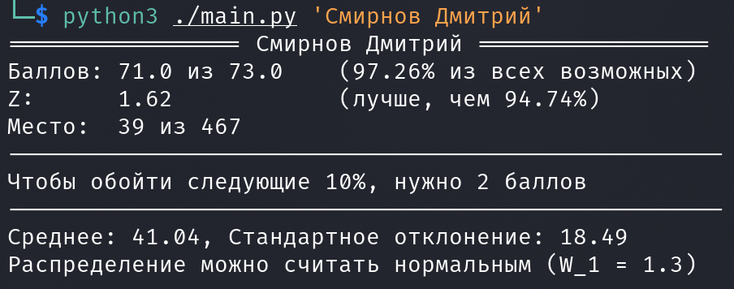

### Статистика по машинке

Использование:
`python3 ./main.py 'Фамилия Имя'`



Реализован кэш. Если файл кэша не старше 3 часов (можно изменить на любое другое количество), таблица загружается оффлайн, что позволяет снизить нагрузку на тестирующую систему и значительно ускорить работу программы. Иначе таблица загружается с сайта. Для этого необходим файл `headers.txt`, в котором должны быть сохранены данные заголовка запроса (скопируйте из браузера) и отформатируйте таким образом:
```
{
    'User-Agent': '...',
    'Accept': '...',
    'Accept-Language': '...',
    'Accept-Encoding': '...',
    'Connection': '...',
    'Cookie': '...'
}
```

Самый главный параметр этого заголовка -- `Cookie`, он должен быть **обязательно**.

Добавьте флаг `-u` для принудительного обновления (**u**pdate) данных.