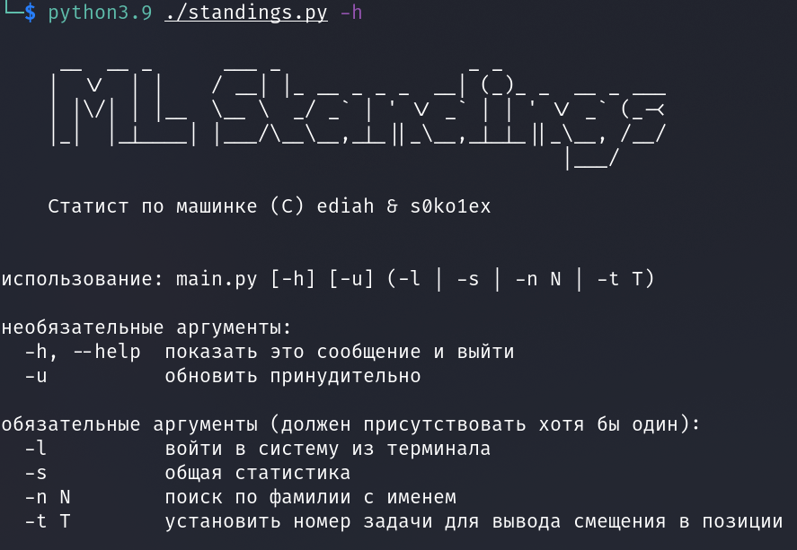

# Статистика по машинке



Полностью консольная утилита чтобы посмотреть свою статистику по машинке.

## Использование

```shell
git clone https://github.com/ediah/ML_Standings
cd ML_Standings
python -m pip install -r requirements.txt
python main.py -h
```

## Фичи

Реализован вход полностью через консоль, что позволяет не копаться в куках браузера. Если вы не доверяете этой программе, то <s>посмотрите сорцы</s> заполните файлик `headers.json` по примеру `default_headers.json`, заменив те параметры, которые хотите, но **обязательно** заполните актуальную сессию в параметре `Cookie`.

Реализован кэш. Если файл кэша не старше 3 часов (можно изменить на любое другое количество), таблица загружается оффлайн, что позволяет снизить нагрузку на тестирующую систему и значительно ускорить работу программы. Иначе таблица загружается с сайта. При желании, можно вручную обновить кэш при очередном запросе.

При запросе статистики по пользователю, рисуется картинка распределения оценок. Она сохраняется с текущей датой в папку `img`.

## Опции

### Вход в систему

Опция: `-l`

Генерация файла `headers.json` по файлу `default_headers.json` и по полученной от сайта куке сессии. Таже вход из консоли автоматически запускается если программа запускается без файла `headers.json`.

### Общая статистика

Опция: `-s`

Выводит статистику топ-10 людей в таблице/статистику по 10 ближайшим людям к человеку, введённому через параметр `-n`.

### Поиск по имени

Опция: `-n`

Выводит подробную информацию по конкретному человеку, при сочетании с опцией `-s` смотри выше.

### Обновление кэша

Опция: `-u`

При наличии этой опции при любом запуске, кэш обновляется.

## Скриншот


